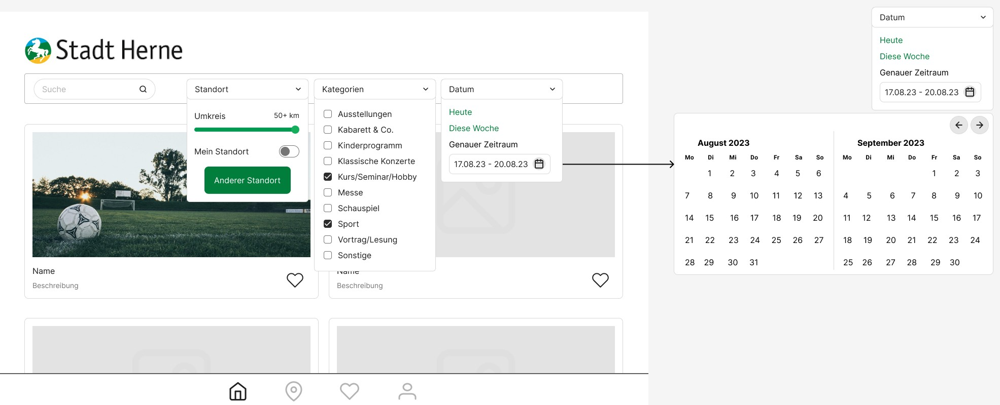
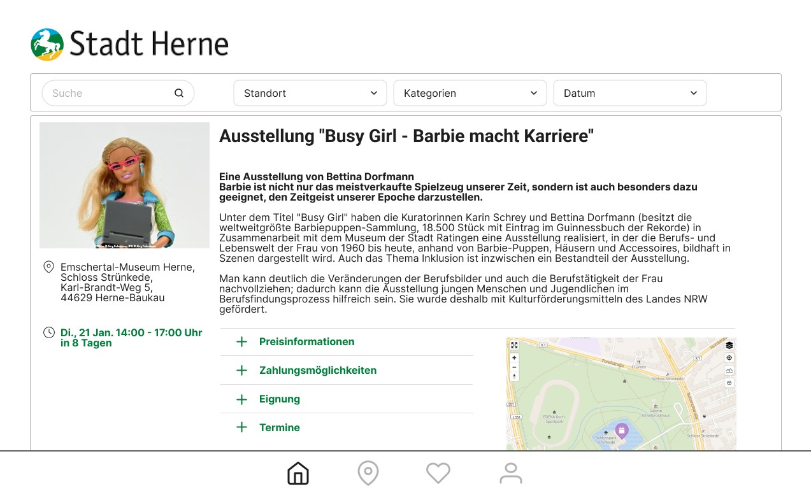
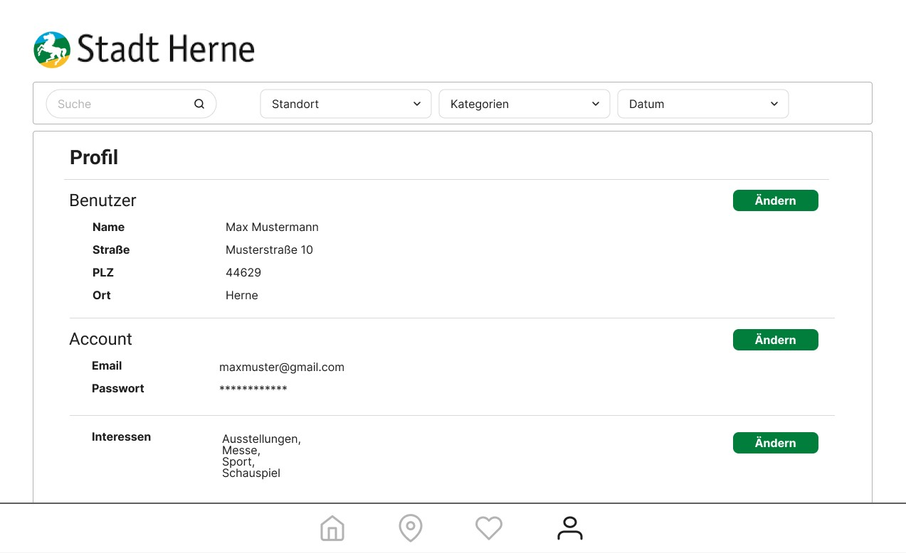

# SWT B

## Name
KidsApp für die Stadt Herne

## Voraussetzungen
- Node.js
  - pnpm Package Manager

## Entwicklungsstack
- IDE: Visual Studio Code, IntelliJ
- Vite + React + Typescript
- MaterialUI als Hauptkomponenten Library

## Mockup
- Startseite
   
  

- Filter
   
  

- Detailansicht
   
  

- Profil
   
  

## Autoren
- Henrik Abtmeyer
- Mike Diefenbach
- Lara Koutsouraki

## Projektstatus
Das Projekt befindet sich aktuell in der Entwicklung.
